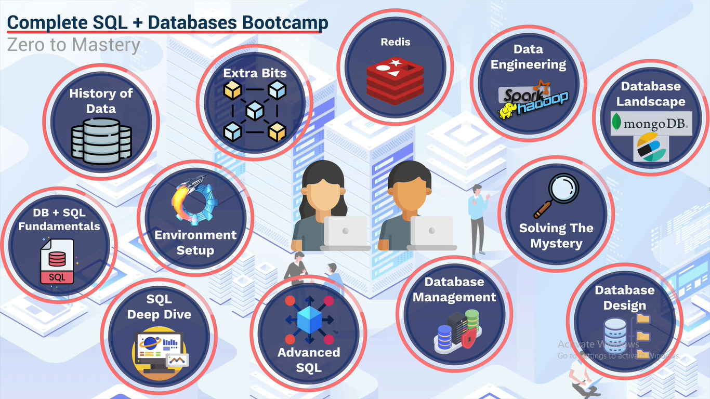

# Course Introduction

- Complete SQL and Databases Bootcamp Course is taught by ZTM Academy Instructors - Andrei Neagoie and Mo Binni

[Course Outline Screenshot](./1_1_sql_bootcamp_course_outline.png)

<!--  -->

> Image Credits: Complete SQL and Databases Bootcamp ZTM Course

## Resources

- [DBMS Repo - LLM Friendly Text File](https://gitingest.com/AswinBarath/Database-Management-Systems)
- [SQL Cheatsheet](https://zerotomastery.io/cheatsheets/sql-cheat-sheet/)
- [SQL Cheatsheet (PDF Version) - Credits ZTM Academy](./5.0_SQL_Cheatsheet_Zero_To_Mastery_V1.01.pdf)
- [SQL Interview Prep: 24 Essential Questions, Answers + Code Examples](https://zerotomastery.io/blog/sql-interview-questions/)
- [Top 7 SQL Project Ideas (+ Code) To Level-Up Your Skills This Year](https://zerotomastery.io/blog/sql-project-ideas/)
- [SQL Data Analysis & Data Visualizaiton Projects](https://github.com/ptyadana/SQL-Data-Analysis-and-Visualization-Projects)

### Course Introduction – Notes

- The course is taught by ZTM Academy Instructors: Andrei Neagoie and Mo Binni.
- There is an active online community for students to interact, ask questions, and get support.
- The course starts with a real-world scenario: investigating a data breach at "CACO court" to set the stage for learning.

#### Course Structure & Topics

1. **History of Data & Databases**
   - What is a database?
   - Types of databases.
   - Why companies use databases over pen and paper or Excel.

2. **SQL Fundamentals**
   - What is SQL?
   - How to write queries.
   - Understanding tables, primary keys, foreign keys.
   - OLTP vs OLAP databases.

3. **Environment Setup**
   - Using professional tools (Valentina Studio, PostgreSQL).
   - Setting up databases on Mac, Linux, and Windows.
   - Creating databases and running queries.

4. **SQL Deep Dive**
   - Functions, aggregate functions.
   - Filtering data, comparison operators.
   - Working with dates, data types.
   - Joins (various types).

5. **Advanced SQL**
   - Indexes for performance.
   - Subqueries.
   - Advanced clauses: PARTITION BY, ORDER BY, GROUP BY.

6. **Database Management**
   - Setting up databases in organizations.
   - Assigning roles and privileges.
   - Data types, columns, tables.
   - Backups and restores.

7. **Database Design**
   - Designing optimized databases.
   - System design: top-down and bottom-up approaches.
   - Relational model and best practices.

8. **Capstone Mystery Project**
   - Apply learned skills to solve a database mystery.
   - Access and analyze real databases to find clues.

9. **Industry Overview**
   - Scalability, sharding, replication, backups.
   - Distributed vs centralized databases.
   - Security: SQL injection, password storage.
   - Relational vs NoSQL databases (PostgreSQL vs MongoDB).
   - Other databases: ElasticSearch, S3 object storage.

10. **Bonus Sections**
    - Data engineering: machine learning, Hadoop, Spark, Kafka.
    - Key-value and in-memory databases (e.g., Redis).
    - Connecting databases to web apps.

#### Additional Points

- The course includes many exercises for hands-on practice.
- The goal is to provide a comprehensive understanding of databases and SQL, from basics to advanced topics.
- By the end, students will be able to connect the dots and understand the database landscape.

---
