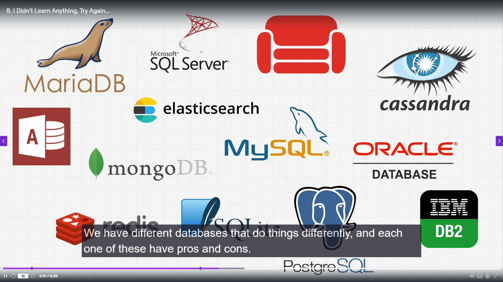
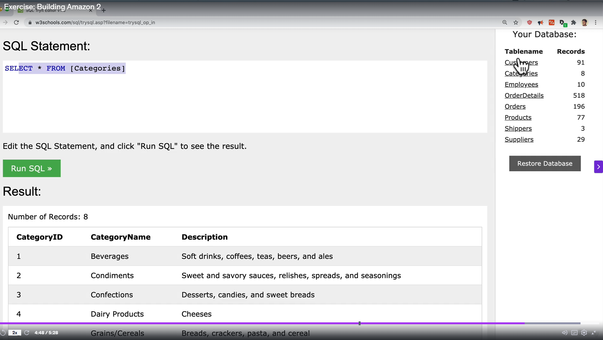
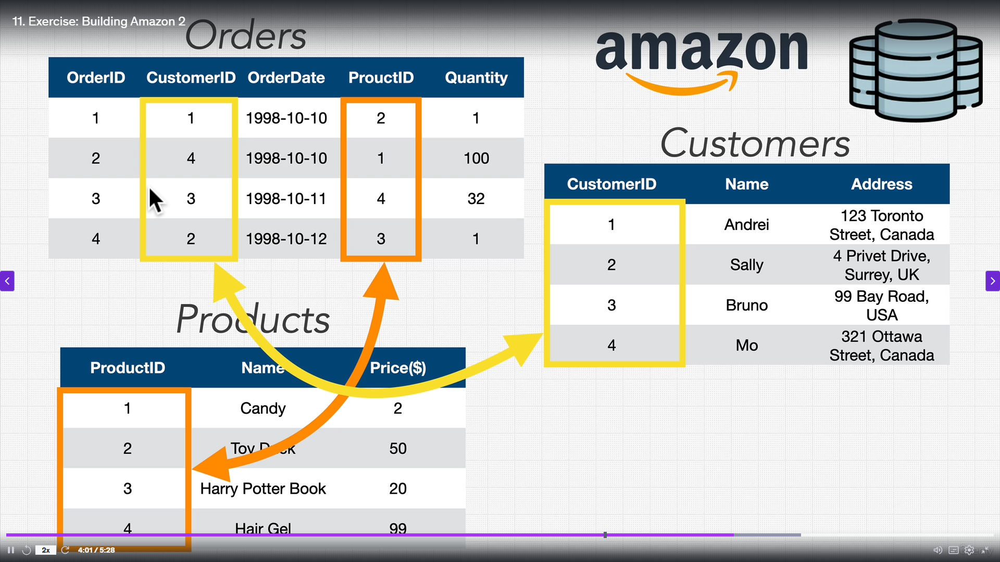

# Database 101 and History

## Resources

- [SQL Playground - W3 Schools](https://www.w3schools.com/sql/trysql.asp?filename=trysql_op_in)

## Introduction & Big Picture

- The section aims to clarify what a database is, regardless of your prior experience.
- Databases are deeply connected to many fields: web development, Python, machine learning, and more.
- Understanding databases helps you see the "big picture" and connect concepts across tech.

## What is a Database?

- **Definition:**  
  A database is a collection of data and a method for accessing and manipulating that data.
- **Importance of Data:**  
  - Data is everywhere and is now considered the most valuable commodity in the world.
  - Companies like Uber, Alibaba, Amazon, Facebook, and Google are valuable largely because of the data they control.
  - Every day, we generate massive amounts of data: from drones, mobile apps, websites, security cameras, and even autonomous cars.
  - Estimated: 2.5 quintillion bytes of data are produced every year (quintillion = 18 zeros!).
  - More data has been collected in the past two years than in all of human history.

## Why Do We Need Databases?

- Data is only valuable if it is captured and used.
- Databases are the tools that allow us to capture, store, and use data.
- The digital universe is estimated to contain about 44 zettabytes of data (zettabyte = 21 zeros!).
- Without databases, storing and making use of this massive amount of data would be impossible.
- Databases enable all modern tech: autonomous cars, social media, search engines, etc.

## What is a Database, Really?

- At their core, databases are just computers (hardware) running special software.
- The "cylinder" icon for databases comes from historical drum memory, which was cylindrical in shape.
- Today, a database is simply a computer (or server) with database software installed.

## Databases in Practice

- You can turn any computer (even a phone or laptop) into a database by installing the right software.
- Examples:  
  - Google Sheets or Excel can be considered simple databases (store and manipulate data).
  - Pen and paper is a non-digital database.
- The reason we use specialized databases instead of just Excel:
  - Scalability: Excel can't handle huge amounts of data.
  - Integrity: Databases can enforce rules so not everyone can modify or delete data.
  - Automation: Databases can be used by programs to automate tasks.
  - Security: Databases can restrict access and protect data.
  - Combining data: Databases can link and combine multiple datasets.

## Types of Databases

- There are many types of databases, each with pros and cons, because data and use cases vary.
- Learn the main types and how to interact with them, helping you choose the right one for your needs.

> Image Credits: Complete SQL and Databases Bootcamp ZTM Course

## Real-World Example: Keiko Corp (Imaginary Company)

- Companies like Keiko Corp use databases for many purposes:
  - **Product Managers:** Analyze product health and performance using data.
  - **Marketers:** Use data to make business decisions and gain insights.
  - **Web/Mobile Developers:** Store user profiles, game states, and more.
  - **Data Analysts/Scientists:** Analyze data, build machine learning models, and make company decisions.
  - **Data Engineers/DBAs:** Set up, maintain, and connect databases, using tools like Hadoop, Presto, BigQuery, Redshift.

- Different roles in a company use and interact with databases in different ways.

## Why Learn SQL?

- Despite the variety of databases and roles, the most common way to interact with databases is by writing queries (questions) using SQL (Structured Query Language).
- SQL is the universal language for communicating with most databases.

## What you should learn?

Here are the DB basics you need to focus on next:

1. How to put data into a database.
2. How to update and learn from data.
3. How to remove data.
4. How to use SQL for all these operations.

## Key Terms & Acronyms

- **DBMS (Database Management System):**  
  Software that manages databases, receives instructions, and manipulates data.
- **RDBMS (Relational Database Management System):**  
  A type of DBMS that uses the relational model (tables with relationships). Examples: MySQL, SQLite, PostgreSQL, Microsoft SQL Server, Oracle.
- **SQL (Structured Query Language):**  
  The language used to interact with DBMS/RDBMS.

## How It All Fits Together

- Data is stored in a database.
- A DBMS/RDBMS manages the data and provides functions for CRUD operations (Create, Read, Update, Delete).
- SQL is used to communicate with the DBMS/RDBMS.
- Most major databases (PostgreSQL, MySQL, MariaDB, SQL Server, Oracle, etc.) support SQL, making your skills transferable.

## Why SQL is Powerful

- Learning SQL allows you to work with many different databases and in many different roles.
- SQL is designed to be simple and English-like, making it accessible to anyone.

## Next Steps

- Start to move from theory to practice:  
  - Learn how to install a database.
  - Add data.
  - Write your first SQL statements.
  - See how companies like Amazon evolved from no database, to spreadsheets, to full databases.

## How Amazon Evolved Its Data Management (Imaginary Analogy)

### 1. Early Days: Pen and Paper

- In the 1990s, Amazon started as a small business.
- Let's assume Jeff Bezos would have manually record orders using a notebook and pen.
- Example: Writing down customer names, what they ordered (e.g., "Joe ordered a Harry Potter book"), payment, and shipping address.
- This method quickly became overwhelming as the number of orders grew.

### 2. Moving to Spreadsheets

- To improve efficiency, Amazon switched to using Excel spreadsheets.
- Orders were tracked in a digital table: customer names, products, quantities, addresses, etc.
- Example entries:
  - Andrei orders 2 toy ducks.
  - Mo buys 100 candies.
  - Bruno buys hair gel.
  - Sally buys a Harry Potter book.
- This system was cleaner and easier to manage than pen and paper.

### 3. Problems with Spreadsheets

- As the business grew, the spreadsheet became harder to manage:
  - Duplicate or conflicting entries (e.g., Andrei orders glasses, returns them, then reorders after moving to Japan—now two addresses for the same person).
  - Manual tracking of changes and customer details became confusing.
  - More data and more rows led to more complexity and potential for error.
- Spreadsheets are not scalable for large, dynamic businesses.

### 4. Introduction to Databases

- Databases solve the problems of scale, organization, and data integrity.
- Instructor encourages students to use the [W3Schools SQL Playground](https://www.w3schools.com/sql/trysql.asp?filename=trysql_op_in) to see a real database in action.

> Image Credits: Complete SQL and Databases Bootcamp ZTM Course
- Key points about databases:
  - Data is organized into multiple tables (e.g., customers, orders, products), not just one big sheet.
  - Each table contains records (rows) and fields (columns) relevant to a specific entity.
  - SQL (Structured Query Language) is used to interact with the database: retrieve, add, update, and delete data.
- Example: Viewing the "customers" table shows each customer with a unique ID and details; "orders" table links orders to customers and products.
- SQL queries allow you to extract exactly the information you need, unlike scrolling through a massive spreadsheet.

### 5. Relational Data Model

- In a database, data is split into related tables:
  - **Customers Table:** Each customer has a unique customer ID and address. Updates (like a new address) are made in one place.
  - **Products Table:** Each product has a unique product ID, description, and price. Changes (like price updates) are centralized.
  - **Orders Table:** Each order has a unique order ID, links to customer ID and product ID, and includes order date and quantity.
- Relationships between tables:
  - Orders reference customers and products by their IDs, not by duplicating all their information.
  - This structure avoids redundancy and makes updates easier and more reliable.
- Exercise: Students are encouraged to explore the playground, connect the relationships, and see how tables link together.

> Image Credits: Complete SQL and Databases Bootcamp ZTM Course

### 6. Advantages of Databases Over Spreadsheets

- Data integrity: One source of truth for each piece of information.
- Scalability: Can handle massive amounts of data.
- Organization: Data is logically separated and linked.
- Efficiency: Easier to update, retrieve, and analyze data.
- Computers can process and understand relational data structures much more efficiently than large, flat spreadsheets.

### 7. Types of Databases (Data Models)

- There are hundreds of database management systems, but most fall into five main types (data models):
  1. **Relational Model:**
     - Most popular (e.g., MySQL, PostgreSQL, Microsoft SQL Server).
     - Uses tables with rows and columns, supports ACID transactions.
     - Great for e-commerce, business applications, and anything needing structured, related data.
     - SQL is the primary language.
  2. **Document Model:**
     - Used by databases like MongoDB, CouchDB, Firebase.
     - Stores data as documents (often JSON-like), not rows and columns.
     - Good for scalability and flexible, nested data.
     - Popular in modern web and mobile apps.
  3. **Key-Value Model:**
     - Examples: Redis, etcd, DynamoDB.
     - Data is stored as key-value pairs (like a dictionary or map).
     - Extremely fast for simple lookups.
     - Used for caching, session storage, and simple data retrieval.
  4. **Graph Model:**
     - Examples: Neo4j, AWS Neptune.
     - Data is stored as nodes and edges (relationships).
     - Excellent for highly connected data (e.g., social networks).
     - Less common, but powerful for specific use cases.
  5. **Wide-Column Model:**
     - Examples: Apache Cassandra, Google Bigtable.
     - Data is stored in tables, but columns can vary by row and are grouped for performance.
     - Designed for big data and high scalability.
- Students are encouraged to focus on relational, document, and key-value databases first, then explore others as needed.

### 8. Key Takeaways and Next Steps

- You will likely only use a few types of databases in your career, but understanding the main models helps you choose the right tool for the job.
- So first focus on SQL and relational databases, but also introduce yourself the basics of other models and when to use them.
- The next steps:
  - Learn how to install a database management system (DBMS) on your computer.
  - Practice adding, updating, and querying data using SQL.
  - Explore when to use different types of databases for different scenarios.
- The instructor emphasizes the importance of having useful data and knowing how to use SQL to interact with it.
- The journey is just beginning—get ready to dive in and build real skills!
